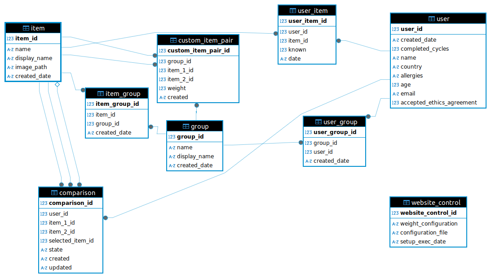

By default the data stored by the system can be exported on the command line. There is also an option to configure the
system to expose two specific tables from the database via an API. This can be useful for quick checks on the judgements
or for running continuous analysis on the results.

## Command Line Export

The data in the database can be exported using the following command.

```bash
flask --debug export
```

This will export the database contents to a zip file containing one .csv file per database table. The file will be saved
at the location configured in the **exportPathLocation** key in the configuration file. 

There is also an option to export the data to a zip file of .tsv files rather than .csv files.

```bash
flask --debug export --format=tsv
```

The database structure is shown in the diagram below. The key tables are user, item and comparison. The user table 
stores information about the user, the item table contains information about the items (or images) being compared and
the comparison table contains the information about the judgements. The other tables mostly serve to make connections 
between these main tables. For example the item_group table contains information which shows which items belong in
which group (the details of the group such as the name are in the group table) and the user_group table shows which 
users know which groups.



## API 

There is also an option to expose the table containing the decisions made by users (no user details) and the table
containing the item details via a secured API. 

To enable the API:

+ set the `API_ACCESS` variable in the `configuration/flask.py` file to `True`
+ create a file at the top level of the repository which should contain the secret key which will be used to authenticate API calls
+ set the `API_KEY_FILE` variable n the `configuration/flask.py` file to the name of the file containing the secret key (the default is `.apikey`)

Once the API is enabled the two tables can be accessed at the following two urls:

+ http://localhost:5001/api/judgements
+ http://localhost:5001/api/items

To access the data in the API requests must use the secret key to authenticate. All programming languages
will have support for this. The following two examples show how to access the API from a command line using curl and
using an R script. These scripts include the API key in a raw form to keep the examples simple. When writing scripts to
access the API you will need to be mindful of how the key is stored in the scripts themselves. The key should be passed
into the script in a secure way such as using your operating system keychain or using an encrypted file.

An example using the command line:

```bash
curl -X GET localhost:5001/api/judgements -H "x-api-key: my_secret_api_key"
```

An example using R to read the data into a data frame:

```R
library(httr2)
req <- request('http://localhost:5001/api/judgements') |>
  req_headers('x-api-key' = 'my_secret_api_key')
data <- req |> req_perform() |> resp_body_string()
df <- read.table(text = data, header = TRUE, sep = ',')
```
