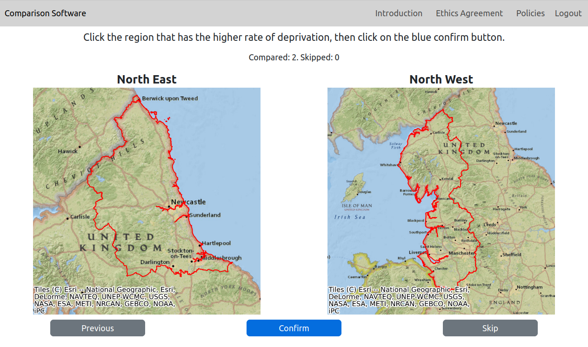

# Summary

Comparative Judgement is a research technique which asks participants to make pairwise judgements of items based on a given criteria, for example which of two areas has the higher rate of deprivation. These pairwise judgements have been shown to be easier for people to make than alternatives such as making a absolute judgement based on a scale or putting a whole series of items in order based on a criteria [@Jones2023]. These models are gaining popularity in social sciences but the options for data collection remain limited. The comparison-interface is a Flask app provides a specialist interface for comparative judgement which is domain agnostic and highly configurable in terms of its behaviour and the text presented to the user. This means that the same code can be configured to collect comparative judgement data on different topics using different languages making it applicable to a wide range of research projects. The website complies with WCAG 2.2 level AA and works on smaller screens such as phones and tablets as well as larger screens. It can be configured without any programming knowledge using JSON or a combination of JSON and a CSV file and any set of images can be used. All of the data collected is stored in a SQLite3 database and an export to CSV files is provided. Example configurations are provided as a starting point for users. The interface has been used to collect data for a number of studies, for example [@Seymour2022; @Seymour2025].

# Statement of Need

 Comparative judgements can not be collected through traditional research survey software, for example KoboToolbox, or Jisc's Online Surveys, formerly known as BSOS. We are only aware of two packages that do provide data collection software, both of which are for specific contexts. NoMoreMarking [@Jones2015] provide proprietary but free to use software that is designed for schools and other education providers to run studies about student assessment. While custom studies can be created the system to design these is tailored to the education context and is not applicable to all comparative judgement studies, again because of the context, each judge needs to be sent the url and register with their email address so it is not suitable for open or anonymous studies. The open source python package PsychoPy [@Peirce2019] can be used to run comparative judgement studies for experimental psychology studies. This software is not specific to comparative judgement but allows a lot of different types of studies to be created. While this is an advantage for some research which needs to combined different techniques, it makes setting up a comparative judgement study more complex. The comparison-interface aims to make comparative judgement studies simpler, more efficient and more attractive to run across a wide range of disciplines.

 The full list configuration options are explained in our documentation and includes the option to configure all of the text that the user sees on the webpage which means that the system can be configured to work with any language, defaults are provided in English for all text strings. Some of the behaviour of the website can also be tailored to the requirements of the project, for example the system can be set to either allow tied decisions or not and to allow users to skip decisions or not depending on the nature of the study.

 One of the key ways the system can be configured is in the way that the items are selected for presentation to the user. There is an option to group items and ask users which groups they have knowledge of when they register, items wil only be selected form the groups selected. Knowledge can also be determined at the level of the item if necessary, although this means showing each item to the user before the comparative judgement phase can start so is not necessarily suitable for large item sets. As well as determining which images are selected for a particular user the way they are selected is also configurable; either each pair can have an equal chance or each pair can be weighted with the higher weighted pairs having a greater chance of being presented than the lower weighted pairs. The latter configuration can be particularly useful for Geographically based studies and can reduce the number of comparisons required [@Seymour2025]. 

 { width=80% }

# Acknowledgements and Funding

This work was supported by a UKRI Future Leaders Fellowship [MR/X034992/1].

# References

